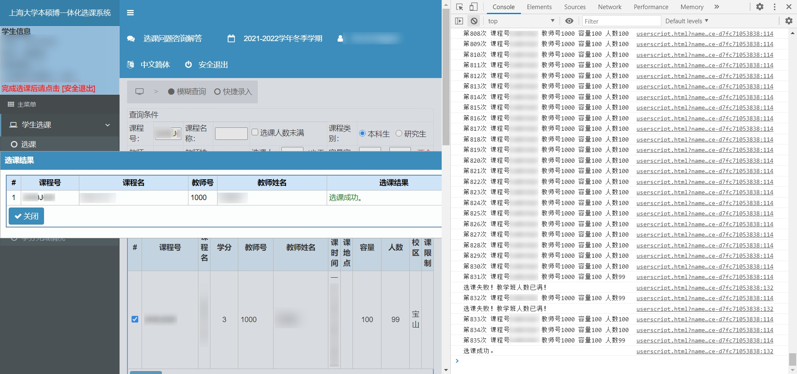

# 上海大学网站增强优化脚本 - 刷课助手

## 功能

1. 支持第二、三轮选课自助刷课，解放双手。**【人人有课刷，抵制卖课狗】**
2. 教学评估页面可一键赋值
3. 将选课系统学分完成情况页面的原始成绩换算成绩点，标红压线分数
4. 标红选课排名页面排名超过额定人数的课程
5. 移除教务管理主页企业微X广告

## 安装
在浏览器安装脚本管理器（Tampermonkey等）后，

Greasy Fork 主页: [点击跳转](https://greasyfork.org/zh-CN/scripts/434613-%E4%B8%8A%E6%B5%B7%E5%A4%A7%E5%AD%A6%E7%BD%91%E7%AB%99%E5%A2%9E%E5%BC%BA)

GitHub 源：[点击安装](https://github.com/panghaibin/shu-web-js/raw/master/shu-web.user.js)

jsDelivr 源：[点击安装](https://cdn.jsdelivr.net/gh/panghaibin/shu-web-js@master/shu-web.user.js)

## 使用
### 刷课功能简介
此刷课程序仅对“人数已满”的课程有效。

安装脚本后，修改源代码，填入课程号和教师号
```javascript
//--------刷课配置--------
// 任意参数留空将不执行
// 输入课程号
let course_id = ''
// 输入对应的教师号
let teacher_id = ''
// 刷课间隔，默认 8000 ，单位毫秒 一般不需要修改
let delay_time = 8000
```
然后在浏览器中打开选课系统的“模糊查询”页，脚本会自动查询并判断选课人数是否小于容量人数，小于则执行选课，否则继续查询。

按下F12，打开浏览器的“控制台(Console)”可以查看脚本的运行状态。

运行成功截图


